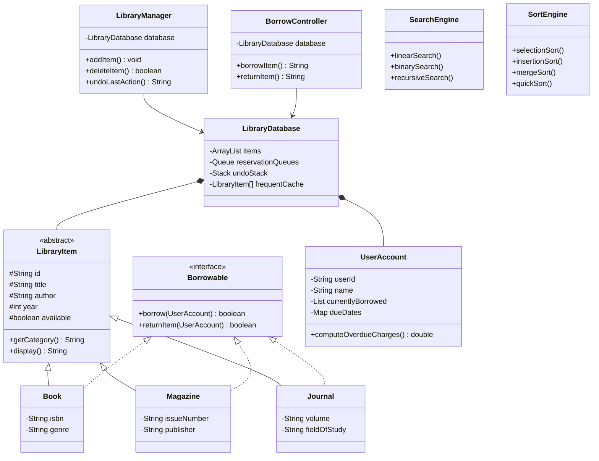

# Smart Library Circulation & Automation System (SLCAS)
## COS 202 Project Report
**Omobolaji Durojaiye**
**Software Engineering 200 Level**
**2024/C/SENG/0814**

## Source Code

**GitHub Repository:** [https://github.com/OmobolajiDurojaiye/COS-202-Smart-library-circulation-Automation-System](https://github.com/OmobolajiDurojaiye/COS-202-Smart-library-circulation-Automation-System)


### 1. Description

The Smart Library Circulation & Automation System (SLCAS) is a Java Swing desktop application designed for a university library. It manages the full lifecycle of library operations including cataloguing books, magazines, and journals, processing borrow/return transactions with reservation queues, automated overdue reminders, and interactive GUI dashboards with reporting capabilities.

The system demonstrates advanced object-oriented programming principles, efficient data structures, multiple sorting and searching algorithms, recursive programming techniques, and event-driven GUI development with Swing.


### 2. Features

### Core Functionality
- **Add, Delete, and View Library Items** :Books, Magazines, and Journals can be added through the Admin panel with type-specific fields (ISBN/Genre, Issue Number/Publisher, Volume/Field of Study). Items can be deleted by ID and all operations can be undone.
- **Borrow and Return Items** :Users can borrow available items and return them. If an item is unavailable, the user is automatically placed in a reservation queue (waitlist).
- **Reservation Queue** :When a borrowed item is returned, the system automatically assigns it to the next user in the queue (FIFO).
- **Undo Last Admin Action** :Uses a Stack to support undoing the last add or delete operation.
- **Search by Title, Author, or Type** :Three search algorithms are available: Linear Search, Binary Search (requires sorted data), and Recursive Search.
- **Sort by Title, Author, or Year** :Four sorting algorithms are available: Selection Sort, Insertion Sort, Merge Sort, and Quick Sort. The user can choose both the field and algorithm via GUI dropdowns.
- **Reports** :Three types of reports are generated: Most Borrowed Items, Users with Overdue Items (with computed charges), and Category Distribution.
- **Data Persistence** :All library items and user accounts are saved to text files (`library_items.txt`, `library_users.txt`) and reloaded on startup.
- **Export Catalogue** :The full catalogue can be exported to a text file via a File Chooser dialog.
- **Overdue Reminders** :A Swing Timer checks for overdue items every 60 seconds and updates the status bar.

### GUI Features
- Tabbed interface with four panels: View Items, Borrow/Return, Admin, Search & Sort
- Tables with custom cell renderers (colour-coded Available/Borrowed status)
- CardLayout for dynamic form switching based on item type selection
- File Chooser dialog for import/export
- Input validation with dialog popups
- Keyboard shortcuts/mnemonics on all major buttons
- Tooltips on all interactive components
- Status bar showing system messages and overdue alerts

### Screenshots of GUI

### View Items Tab


### Borrow/Return Tab


### Admin Tab


### Search & Sort Tab


### 3. Data Structures Used

| Data Structure | Purpose | Location |
|---|---|---|
| **ArrayList** | Primary storage for library items and user accounts | `LibraryDatabase.java` |
| **Queue (LinkedList)** | Reservation/waitlist queue per item. FIFO ordering ensures fairness | `LibraryDatabase.java` |
| **Stack** | Undo stack for admin actions. LIFO ordering for correct undo sequencing | `LibraryDatabase.java` |
| **Array (fixed-size)** | Quick cache of the top 5 most frequently borrowed items | `LibraryDatabase.java` |
| **HashMap** | Maps item IDs to reservation queues; maps item IDs to due date timestamps | `LibraryDatabase.java`, `UserAccount.java` |

### Why Did I Use These Structures?
- **ArrayList** provides O(1) random access for displaying items in the table and efficient iteration for search/sort operations.
- **Queue** (LinkedList-backed) provides O(1) enqueue/dequeue, which is essential for fair FIFO reservation processing.
- **Stack** provides O(1) push/pop operations, naturally supporting the last-in-first-out undo pattern.
- **Fixed-size Array** is used as a lightweight cache with O(1) access, ideal for the "Most Frequently Accessed Items" quick-lookup feature where the cache size is predetermined.
- **HashMap** provides O(1) average-case lookups for reservation queues and due dates by item ID.


### 4. Algorithms Chosen and Why

### Search Algorithms
1. **Linear Search** O(n) time, works on unsorted data. Used as the default general-purpose search across all fields (title, author, type). Chosen because it requires no preconditions.
2. **Binary Search** O(log n) time, requires sorted data. Used for title searches after the list has been sorted by title. Chosen for its efficiency on sorted data.
3. **Recursive Search** O(n) time, demonstrates recursion. Searches by title using tail-recursive descent through the list. Included to satisfy the mandatory recursion requirement.

### Sorting Algorithms
1. **Selection Sort** O(n²) time, in-place. Simple and educational; suitable for small datasets.
2. **Insertion Sort** O(n²) time, in-place. Efficient for nearly sorted data; adaptive behaviour.
3. **Merge Sort** O(n log n) time, stable. Recommended for larger datasets; demonstrates divide-and-conquer recursion.
4. **Quick Sort** O(n log n) average time, in-place. Space-efficient recursive sort; demonstrates partitioning.

### Why Multiple Algorithms?
The system lets the user select which algorithm to use, enabling experimentation and comparison. A timing display shows the execution time in microseconds after each sort operation.

### Recursive Components
1. **Recursive Search** (`SearchEngine.recursiveSearch`) searches the catalogue by title using list-index recursion.
2. **Recursive Overdue Charge Computation** (`UserAccount.computeOverdueChargesRecursive`) recursively accumulates overdue charges across all currently borrowed items.
3. **Recursive Category Count** (`LibraryDatabase.countByCategoryRecursive`) recursively counts items by category for the distribution report.

---

### 5. Challenges Faced

1. **Java Version Compatibility** The original code used Java 14+ features (pattern matching in `instanceof`, switch expressions). These were refactored to use traditional `instanceof` casting and switch statements to ensure compatibility across Java 8+ environments.

2. **CardLayout with Shared Fields** The Admin panel uses CardLayout to dynamically switch between Book, Magazine, and Journal forms. Since the shared fields (title, author, year) are the same across all three cards, care was needed to prevent Swing from detaching components when switching cards. The extra fields (extra1, extra2) change their tooltip labels dynamically based on the selected type.

3. **Binary Search Precondition** Binary search requires sorted data, but the user might not have sorted first. This was handled by tracking a `sortedByTitle` flag in the Search & Sort panel, and displaying a warning dialog if the user attempts binary search without sorting by title first.

4. **Data Persistence Across Sessions** Designing a text-based file format that could encode all item types (Book, Magazine, Journal) with their type-specific fields required a pipe-delimited format with a type prefix for parsing back to the correct subclass.

5. **Thread Safety in ID Generation** The `IDGenerator` uses `synchronized` methods to prevent duplicate IDs in case of concurrent access, though this is primarily a design consideration for potential future multi-threaded extensions.


### 6. Class Hierarchy (UML)

### Class Hierarchy Diagram (UML)



### 7. Package Structure

```
/model
   LibraryItem.java       — Abstract base class
   Book.java              — Book subclass
   Magazine.java          — Magazine subclass
   Journal.java           — Journal subclass
   Borrowable.java        — Borrowable interface
   UserAccount.java       — User with borrowing history
   AdminAction.java       — Undo action record
   LibraryDatabase.java   — Central data store

/controller
   LibraryManager.java    — Business logic controller
   BorrowController.java  — Borrow/return operations
   SearchEngine.java      — Search algorithms
   SortEngine.java        — Sort algorithms

/gui
   MainWindow.java        — Main application frame
   ViewItemsPanel.java    — Catalogue display panel
   BorrowPanel.java       — Borrow/return panel
   AdminPanel.java        — Admin operations panel
   SearchSortPanel.java   — Search & sort panel

/utils
   IDGenerator.java       — Unique ID generation
   FileHandler.java       — File I/O persistence

Main.java                 — Application entry point
```
